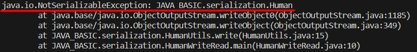
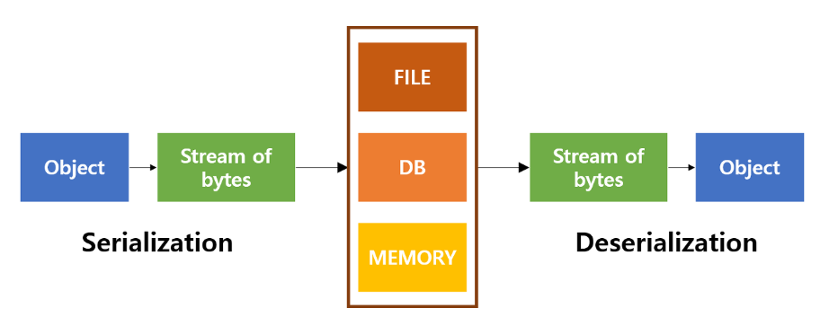
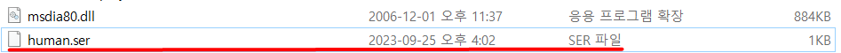
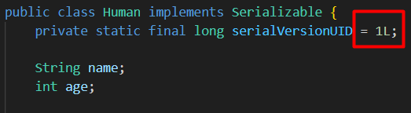
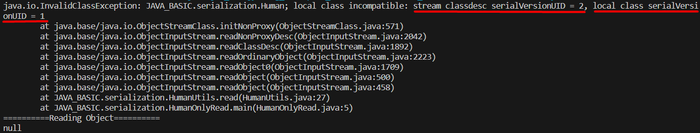

# Serialization - serialVersionUID
JAVA에서 생성한 특정 객체를 파일로 저장하기 위해 코드를 작성하여 저장하고 읽어오는 로직을 구현했는데 컴파일할 때 아래와 같은 에러가 발생했다.



위의 에러가 발생한 이유를 찾다보니 `객체를 파일, 메모리, 데이터베이스로 저장하는 과정에는 직렬화(Serialization)가 필요`하다고 한다.

<br>

## 직렬화(Serialization)란 무엇인가?
그렇다면 직렬화(Serialization)는 무엇인가? 위에서 설명한 것과 같이 자바(JAVA)에서는 `직렬화(Serialization)`는 어떤 객체를 파일, 메모리, 데이터베이스 등으로 저장할 때 해당 객체를 바이트 배열로 변환시켜 저장시킨다고 한다.

이렇게 저장된 것을 다시 객체로 되돌리는 것을 `역직렬화(Deserialization)` 라고 한다.



여기까지 찾아 봤을 때 직렬화(Serialization)라는 것이 무엇이며 어떤 경우에 직렬화를 사용해야할지 대충 머리 속에 들어 왔다. 그래서 객체를 Serializable 인터페이스를 상속받아 객체를 저장해보니 문제 없이 저장되는 것을 확인하였다.

좀 더 직렬화에 관해 찾아보다 보니 Serializable 인터페이스를 구현할때 `serialVersionUID`라는 녀석에 값을 할당하라고 하는 내용이 보인다.

<br>

## serialVersionUID 사용 용도 및 필요성
그렇다면 serialVersionUID는 또 무엇인가?

Serializable를 상속하는 Class의 경우 Class의 versioning용도로 이 `serialVersionUID` 변수를 사용한다고 한다. 이를 지정하지 않으면 Compiler가 계산한 값을 임의로 부여하는데 Serializable Class나 Outer Class에 변경 사항이 있으면 serialVersionUID 값이 바뀌게 되는데, 이는 Serialize 할 때와 Deserialize 할 때의 serialVersionUID 값이 다르면 객체를 불러오지 못한다는 것이다.

위의 내용만으로는 확실하게 와 닿지 않아 예시 코드를 구현하여 테스트 해보려 한다.

<br>

## 직렬화와 serialVersionUID 사용 예시

### Human.class
```JAVA
import java.io.Serializable;

public class Human implements Serializable {
    private static final long serialVersionUID = 2L;

    String name;
    int age;

    public String getName() {
        return this.name;
    }

    public void setName(String name) {
        this.name = name;
    }

    public int getAge() {
        return this.age;
    }

    public void setAge(int age) {
        this.age = age;
    }

    @Override
    public String toString() {
        return new StringBuffer("Name:")
                .append(this.name)
                .append(", Age:").append(this.age)
                .toString();
    }

}
```

실제 예시를 만들기 위해 Human이라는 클래스에 Serializable 인터페이스를 상속받았다.

### HumanUtils.class
```JAVA
import java.io.FileInputStream;
import java.io.FileOutputStream;
import java.io.ObjectInputStream;
import java.io.ObjectOutputStream;

public class HumanUtils {
    public static final String path = "E:\\human.ser";

    public static void write(Human address) {
        try {
            FileOutputStream fout = new FileOutputStream(path);
            ObjectOutputStream oos = new ObjectOutputStream(fout);
            oos.writeObject(address);
            oos.close();
        } catch (Exception e) {
            e.printStackTrace();
        }
    }

    public static Human read() {
        Human address;
        try {
            FileInputStream fin = new FileInputStream(path);
            ObjectInputStream ois = new ObjectInputStream(fin);
            address = (Human) ois.readObject();
            ois.close();

            return address;
        } catch (Exception e) {
            e.printStackTrace();
        }
        return null;
    }
}
```

HumanUtils라는 클래스로 Human 객체를 직렬화(Serialization)하여 저장하고 역직렬화(Deserialization)하여 불러오는 함수를 작성했다.

직렬화하여 바이트 배열로 만든 객체를 `E:\\` 경로에 `human.ser`라는 명칭으로 serializion 파일로 저장해 놓았고, 불러올 때 해당 파일을 불러와 읽게 했다.

이제 메인 스레드에서 객체를 저장하고 불러오는 작업을 진행시켜 보자.

### HumanWriteRead.class

```JAVA
public class HumanWriteRead {
    public static void main(String[] args) {
        Human human = new Human();

        human.setName("LAGOM");
        human.setAge(30);

        HumanUtils.write(human);
        System.out.println("==========Writing Object==========");
        System.out.println(human);

        Human readingHuman = HumanUtils.read();
        System.out.println("==========Reading Object==========");
        System.out.println(readingHuman);
    }
}
```

```TEXT
==========Writing Object==========
Name:LAGOM, Age:30
==========Reading Object==========
Name:LAGOM, Age:30
```
작업을 진행시키면 위와 같은 결과가 출력되는 것을 확인 할 수 있다. 또한 아래와 같이 .ser 확장자를 가진 파일이 생성된 것을 확인 할 수 있다.



위의 저장된 human.ser 파일은 serialVersionUID=2L로 직렬화 하여 저장한 파일이다. 그렇다면 Human 객체에서 serialVersionUID=1L로 변경 후 불로오는 작업만 진행하면 어떻게 될까?



Human 객체의 serialVersionUID을 1L로 변경 후 불러오는 작업만 진행해보겠다.

```JAVA
public class HumanOnlyRead {
    public static void main(String[] args) {
        Human readingHuman = HumanUtils.read();
        System.out.println("==========Reading Object==========");
        System.out.println(readingHuman);
    }
}
```



위와 같은 에러가 발생하였다.

```TEXT
java.io.InvalidClassException: JAVA_BASIC.serialization.Human; 

local class incompatible: stream classdesc serialVersionUID = 2, local class serialVersionUID = 1
```

정확한 워딩을 읽어보면 로컬 클래스의 `serialVersionUID = 2` 가 local class `serialVersionUID = 1`와 호환되지 않음 이라고 나온다.

이렇듯 serialVersionUID값은 파일 등으로 저장할 때 해당 객체의 버전이 맞는지를 확인하는 중요한 장치가 된다.

그런데 serialVersionUID를 작성하지 않으면 Java VM에서 내부 알고리즘에 따라서 자동으로 작성하게 되는데 이것은 어떤 Java VM을 사용하는지에 따라서 달라지게 된다.

특히 클라이언트가 Windows이며 서버가 Linux인 경우 Java VM이 서로 다르므로 역직렬화 할 때 위와 같이 에러가 발생할 수 있다.

그러므로 반드시 serialVersionUID은 직렬화 과정에서 꼭 명시해주어야 한다.