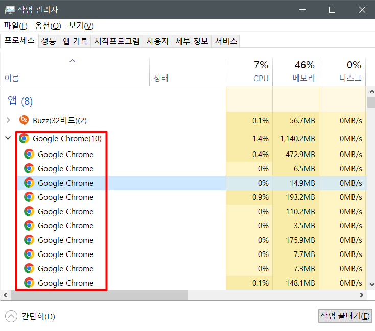
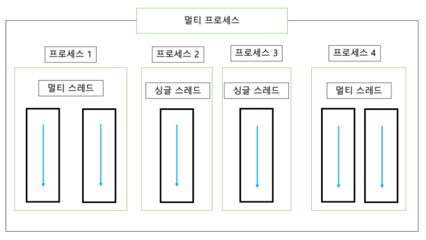

<div style="position:fixed; right:0; width:30%;">

### 목차
1. [프로세스와 스레드](#프로세스와-스레드)
2. [메인 스레드](#메인-스레드)

</div>
    
<div style="top:10%; width:70%;">

## 멀티 스레드 개념
### 프로세스와 스레드

1. 프로세스(Process)

    운영체제에서 실행 중인 하나의 애플리케이션(프로그램)을 가리킨다.
    - 사용자가 애플리케이션(프로그램)을 실행하면 운영체제가 할당해 주는 메모리로 애플리케이션(프로그램)의 코드를 실행하는 것이 프로세스이다.
    - 하나의 어플리케이션은 다중 프로세스를 생성하기도 한다.

        
        - ex >> Chrome 브라우저를 두개 실행하는 경우
        

<br>

2. 멀티 태스킹(Multi Tasking)

    두 가지 이상의 작업을 동시에 처리하는 것을 말한다.

    

    - 운영체제에서 프로세스마다 CPU와 메모리 자원을 필요한만큼 할당해주고 병렬로 실행시킨다.
        - 예를 들어 PC 윈도우에서 엑셀 작업을 진행하며 미디어 프로그램으로 노래를 듣는 것을 멀티 태스킹이라 한다.(멀티 프로세스)
    - 멀티 태스킹 != 멀티 프로세스 이다. 
    - 한 프로세스 내에서 작업을 동시에 처리하는 것 또한 멀티 태스킹이지만, 이것은 멀티 스레드라고 부른다.
        - ex >> 미디어 프로그램에서 노래를 재생시키며 노래에 대한 영상과 채팅을 동시에 처리하는 라이브 스트리밍 플랫폼이 그 예시이다. 
        
    - 멀티프로세스 = 애플리케이션(프로그램) 단위의 멀티 태스킹
    - 멀티스레드 = 애플리케이션(프로그램) 내부에서의 멀티 태스킹
    
<br>

3. 스레드

    한 가지 작업을 실행하기 위해 순차적으로 실행할 코드이다.
    - 하나의 스레드는 하나의 코드 실행 흐름이기 때문에 한 프로세스 내에 스레드가 두개 이상이라면 멀티 태스킹으로써 멀티 스레드가 가능하다는 것이다.

<br>

4. 차이점

    - 멀티 프로세스는 운영체제가 할당한 독립적인 메모리를 가지고 있다.
    - 하나의 프로세스가 오류가 발생해도 다른 프로세스에 영향이 없다.
    - 멀티 스레드는 하나의 프로세스이기 때문에 하나의 스레드가 예외를 발생시키면 프로세스가 종료될 수 있어 다른 스레드에 영향이 있다.

<br>

### 메인 스레드

자바 애플리케이션은 메인 스레드(main thread)가 main() 메소드를 실행하며 시작한다.

- 위에서 아래로 순차적으로 코드를 실행한다.
- 마지막 코드를 실행하거나 return문을 만나면 실행이 종료된다.

    ```JAVA
        public static void main(String[] args) {
            String data = null;
            if(true) {
                ...
            }
            while(true) {
                ...
            }
            System.out.println("...");
        }
    ```
- 필요에 따라 메인 스레드에서 다른 작업 스레드를 생성하여 병렬로 작업을 처리한다.
- 싱글 스레드는 애플리케이션이 종료되면 프로세스가 종료된다.
- 멀티 스레드는 애플리케이션에 하나라도 동작중인 스레드가 존재하면 프로세스는 종료되지 않는다.

</div>