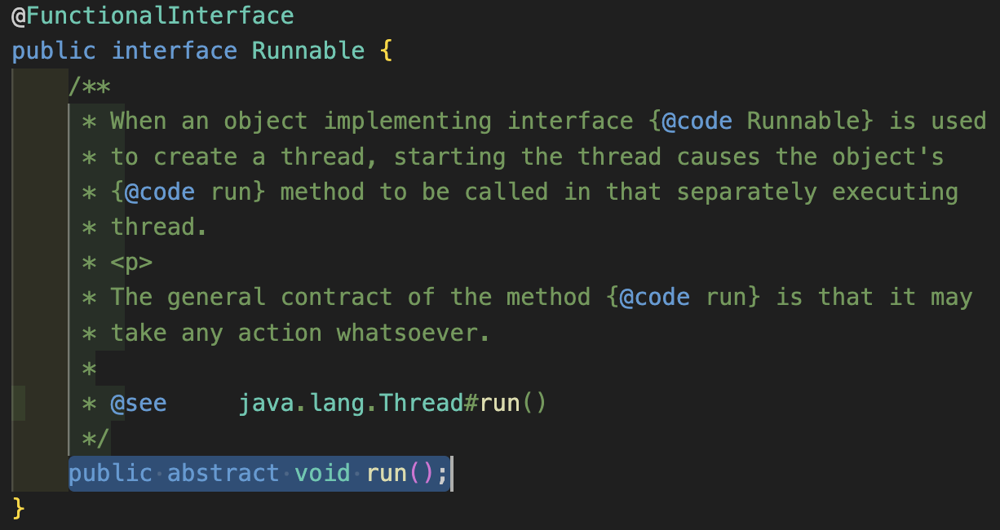

<div style="position:fixed; right:0; width:30%;">

### 목차
1. [작업 스레드 생성과 실행](#작업-스레드-생성과-실행)
2. [스레드 클래스로부터 직접 생성](#thread-클래스-직접-생성)
3. [스레드 하위 클래스 생성](#thread-하위-클래스-생성)

</div>
    
<div style="top:10%; width:70%;">

# 작업 스레드 생성과 실행
멀티 스레드로 동작하는 애플리케이션을 개발하기 위해 몇 가지 작업을 병렬로 동작할지 결정하고 각 작업별로 스레드를 생성해야한다.


- 어떤 자바 애플리케이션이건 메인 스레드는 반드시 존재한다.
- 메인 작업 이외의 추가적인 병렬 처리가 필요하면 그 수만큼 스레드를 생성하면 된다.

- Thread 클래스를 이용하여 직접 객체화하는 방법과 Thread를 상속하여 하위 클래스를 만들어 사용하는 방법이 존재한다.

<br>

## Thread 클래스 직접 생성
```JAVA
Thread thread = new Thread(Runnable target);
```
- 다음과 같이 `Runnable을 매개값`으로 갖는 java.lang.Thread 클래스의 생성자를 호출해야한다.

    - Runnable은 작업 스레드가 실행할 수 있는 코드를 가지고 있는 객체라고 해서 붙여진 이름이다.
    - Runnable은 `인터페이스` 타입이기 때문에 구현객체를 만든 후 대입해야한다.
    - Runnable에는 run() 메소드 하나가 정의되어 있는데, 구현 클래스는 run()을 재정의하여 작업 스레드가 실행할 코드를 작성해야한다.

- Runnable 구현 클래스를 작성하는 방법은 다음과 같다.
    ```JAVA
    class Task implements Runnable {
        public void run() {
            System.out.println("Thread가 실행할 코드 작성");
        }
    }
    ``` 
- Runnable은 작업 내용을 가지고 있는 객체이지 `실제 스레드는 아니다.`
- 아래와 같이 Runnable 인터페이스는 run()이라는 메소드를 선언만 해 놓았지 그에 대한 `스레드 내용은 존재하지 않는다.`
    

### 구현체 호출 및 스레드 생성

```JAVA
Runnable taskExample = new taskExample();

Thread thread = new Trhead(taskExample);
```
- 이제 위와 같이 `Runnable을 상속`받고 `스레드 내용물을 작성`한 구현객체를 생성 후, 이것을 `매개값으로 Thread 생성자`를 호출하면 비로소 작업 스레드가 생성된다.

### 구현체 작성 없이 익명 객체 사용
```JAVA
Thread thread = new Thread(new Runnable() {
    public void run() {
        System.out.prinln("익명객체를 사용한 ")
    }
});
```
- `소스 코드를 절약`하거나 `한 번만 사용하는 경우` Thread 생성자를 호출 할 때 Runnable을 익명 객체를 매개값으로 사용한다.
- 이 방법이 더 많이 사용된다.

### 람다식을 사용한 스레드 생성
```JAVA
Thread thread = new Thread(() -> {
    스레드가 실행할 코드;
});
```
- Runnable 인터페이스는 run() `함수적 인터페이스이다.`

        ❓함수적 인터페이스(@Functionalllnterface)

        람다식이 하나의 메소드를 정의하기 때문에 두 개 이상의 추상 메소드가 선언된 인터페이스는 람다식을 이용해 객체를 생성할 수 없다.
        
        하나의 추상 메소드가 선언된 인터페이스만 람다식의 타겟 타입이 될 수 있다. 이러한 인터페이스를 함수적 인터페이스 (functional interface)라고 한다. 인터페이스 선언시 @Functionallinterface 어노테이션을 붙이면 컴파일러가 두 개 이 상 추상메소드가 선언되었을 시, 컴파일 오류를 발생시킨다.

- 가장 간단한 방법이지만 JAVA8 부터 지원하기 때문에 JAVA7 이전버전에서는 사용할 수 없다.

### 스레드 실행
위의 코드들은 모두 스레드를 생성하는 작업 코드였다. 이를 실행하기 위해서는 아래와 같이 작성해야 그 시점부터 스레드가 실행된다.
```JAVA
thread.start();
```
- start() 메소드가 호출되면, 작업 스레드는 매개값으로 받은 Runnable의 run()메소드를 실행하면서 자신의 작업을 처리한다.

<br>

## Thread 클래스 직접 생성 Example
```JAVA
import java.awt.*;

public class BeepPrintExample1 {
    public static void main(String[] args) {
        // Toolkit을 이용하여 beep음을 발생
        Toolkit toolkit = Toolkit.getDefaultToolkit();
        for(int i=0; i<5; i++) {
            toolkit.beep();

            // 0.5초 텀을 발생
            try {
                 Thread.sleep(500); 
            } catch (InterruptedException e) {
                e.printStackTrace();
            }
        }

        // beep음을 발생시킨다는 내용을 프린팅
        for(int i=0; i<5; i++) {
            System.out.println("삡!");

            // 0.5초 텀을 발생
            try { 
                Thread.sleep(500);
            } catch (InterruptedException e) {
                e.printStackTrace();
            }
        }
    }
}
```
- Toolkit을 이용하여 beep음을 발생시키며 소리가 발생할때 "삡!"을 프린팅 하기위해 위의 코드를 작성하였다.
- 하지만 위의 코드는 하나의 메인 스레드에서 동작하기 때문에 beep음이 5번 발생 완료 후 "삡!"이 5개 플린팅된다.
- 위의 코드를 수정하여 beep음이 발생할때 동시에 "삡!"을 프린팅하게 만들어 보자.

### 스레드 Runnable구현 클래스 작성
```JAVA
import java.awt.Toolkit;

public class BeepTask implements Runnable {
    public void run() {
        // Toolkit을 이용하여 beep음을 발생
        Toolkit toolkit = Toolkit.getDefaultToolkit();
        for(int i=0; i<5; i++) {
            toolkit.beep();

            // 0.5초 텀을 발생
            try {
                Thread.sleep(500); 
            } catch (InterruptedException e) {
                e.printStackTrace();
            }
        }
    }
}
```
- Runnable을 상속 받은 BeepTask 실행 구현체를 작성하였다.
- 이제 작성한 구현체를 호출하여 beep음과 "삡!" 프린팅을 동시에 동작시켜 보자.

### BeepTask 스레드 생성 및 실행
```JAVA
public class BeepPrintExample2 {
    public static void main(String[] args) {
        // beep 작업 스레드 생성
        Runnable beepTask = new BeepTask();
        Thread thread = new Thread(beepTask);
        
        // beep 작업 스레드 실행
        thread.start();

        // beep음을 발생시킨다는 내용을 프린팅
        for(int i=0; i<5; i++) {
            System.out.println("삡!");

            // 0.5초 텀을 발생
            try { 
                Thread.sleep(500);
            } catch (InterruptedException e) {
                e.printStackTrace();
            }
        }
    }
}
```

### Runnable 익명 객체 이용
```JAVA
// Runnable 익명객체 이용
    Thread thread = new Thread(new Runnable() {
        @Override
        public void run() {
            // Toolkit을 이용하여 beep음을 발생
            Toolkit toolkit = Toolkit.getDefaultToolkit();
            for(int i=0; i<5; i++) {
                toolkit.beep();

                // 0.5초 텀을 발생
                try {
                    Thread.sleep(500); 
                } catch (InterruptedException e) {
                    e.printStackTrace();
                }
            }
        }
    });
    thread.start();
```
- 따로 Runnable 구현체를 작성하지 않고 Thread 생성자를 호출할때 익명객체를 이용하여 구현체에 작성했던 run()함수를 익명 객체로 작성하여 실행하였다.

### 람다식 이용
```JAVA
// Runnable 익명객체 이용
    Thread thread = new Thread(() -> {
        // Toolkit을 이용하여 beep음을 발생
        Toolkit toolkit = Toolkit.getDefaultToolkit();
        for(int i=0; i<5; i++) {
            toolkit.beep();

            // 0.5초 텀을 발생
            try {
                Thread.sleep(500); 
            } catch (InterruptedException e) {
                e.printStackTrace();
            }
        }
    });
    thread.start();
```
- 위는 익명객체를 이용한 것과 비슷하게 람다식을 이용하여 스레드를 생성하여 실행하였다.

<br>

## Thread 하위 클래스 생성 
[Thread 클래스 직접 생성](#thread-클래스-직접-생성)하는 방법이 아닌 Thread의 하위 클래스로 작업 스레드를 정의할 수 있다.

```JAVA
class WorkerThread extends Thread {
    @Override
    public void run() {
        System.out.println("스레드가 실행할 코드");
    }
}

public static void main(String[] args) {
    Thread thread = new WorkerThread();
    thread.start();
}
```

위의 Thread의 하위 클래스를 생성하여 Beep 스레드를 동일하게 작동시켜 보자.
</div>