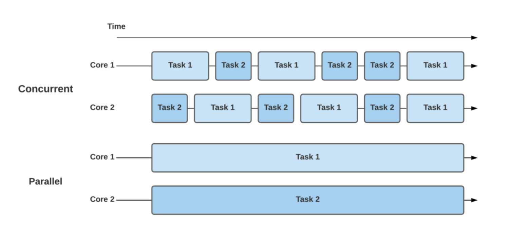

<!-- 목차 영역 -->
<div style="position:fixed; right:0; width:30%;">

### 목차
1. [스레드 이름](#스레드-이름)
2. [스레드 우선순위](#스레드-우선순위)

</div>

<!-- 본문 영역 -->
<div style="top:10%; width:70%;">

# 작업 스레드 속성
## 스레드 이름
멀티 스레드에서 각자의 스레드는 각자의 이름이 부여된다. 메인 스레드는 "main"이라는 이름을 가지고 있고 메인 스레드 외의 직접 생성한 스레드는 자동적으로 "Thread-n"이라는 이름으로 셋팅된다.

### 스레드 이름 부여
```JAVA
    thread.setName("스레드 이름");
```
### 스레드 이름 가져오기
```JAVA
    thread.getName();
```

setName(), getName()은 Thread의 인스턴스 메소드이며, 객체 참조가 필요한 메소드이다. 

만약 스레드에 대한 객체 참조를 가지고 있지 않다면, Thread의 정적 메소드인 currentThread()로 코드를 실행하는 현재 스레드의 참조를 얻을 수 있다.

### 이름부여 & 이름 가져오기
**ThreadA**
```JAVA
public class ThreadA extends Thread {
    public ThreadA() {
        setName("ThreadA");
    }

    public void run() {
        for(int i=0; i<2; i++) {
            System.out.println(getName() + "가 출력한 내용");
        }
    }
}
```

**ThreadB**
```JAVA
public class ThreadB extends Thread{
    public void run() {
        for(int i=0; i<2; i++) {
            System.out.println(getName() + "가 출력한 내용");
        }
    }
}
```

```JAVA
public class ThreadNameExample {
    public static void main(String[] args) {
        // 메인 스레드 이름
        Thread mainThread = Thread.currentThread();
        System.out.println("프로그램 시작 스레드 이름: " + mainThread.getName());

        // 이름 부여한 스레드
        System.out.println("이름 부여한 스레드");
        Thread threadA = new ThreadA();
        threadA.start();
        
        // 이름 부여하지 않은 스레드
        System.out.println("이름 부여하지 않은 스레드");
        Thread threadB = new ThreadB();
        threadB.start();
    }
}
```
- 메인 스레드의 이름은 Thread의 전역 메소드인 currnetThread.getName()를 불러와 호출
- ThreadA 스레드는 해당 스레드 명칭을 수동으로 부여 및 호출
- ThreadB 스레드는 자동으로 명칭이 부여 후 호출

<br>

## 스레드 우선순위
멀티 스레드는 동시성과 병렬성으로 실행된다.


      ❓동시성
      멀티 작업을 위해 하나의 코어에서 멀티 스레드가 번갈아가며 실행하는 성질
      ❓병렬성
      멀티 작업을 위해 멀티 코어에서 개별 스레드를 동시에 실행하는 성질

- 싱글 코어 CPU를 이용한 멀티 스레드 작업은 병렬적으로 실행되는 것처럼 보이지만, 사실은 번갈아가며 실행하는 동시성 작업이다. 번갈아 실행하는 것이 워낙 빠르다보니 병렬성으로 보일 뿐이다.

    

- 스레드의 개수가 코어의 수보다 많을 경우, 스레드를 어떤 순서에 의해 동시성으로 실행할 것인가를 결정해야 하는데, 이것을 스레드 스케줄링이라고 한다. 
- 스레드 스케줄링에 의해 스레드들은 아주 짧은 시간에 번갈아가면서 그들의 run() 메소드를 조금씩 실행한다.

<br>

### 스레드 스케줄링 방식
1. 우선순위
    
    우선순위가 높은 스레드가 실행 상태를 더 많이 가지도록 스케줄링하는 것을 말한다.
2. 순환할당

    시간 할당량을 정해서 하나의 스레드를 정해진 시간만틈 실행하고 다시 다른 스레드를 실행하는 방식을 말한다.

- 스레드의 우선순위 방식은 스레드 객체에 우선 순위 번호를 부여할 수 있기 때문에 개발자가 코드로 제어할 수 있다. 
- 순환 할당 방식은 자바 가상 기계에 의해서 정해지기 때문에 코드로 제어할 수 없다.

### 스레드 우선순위 부여
```JAVA
thread.setPriority(우선순위);
``` 
- 위의 코드로 Thread에 1~10까지 우선순위를 줄 수 있다.
```JAVA
thread.setPriority(Thread.MAX_PRIORITY);
thread.setPriority(Thread.NORN_PRIORITY);
thread.setPriority(Thread.MIN_PRIORITY);  
```
- 위와 같이 Thread의 상수를 이용하여 우선순위를 부여할 수 있다.
- Thread.MAX_PRIORITY  = 10
- Thread.NORN_PRIORITY = 5
- Thread.MIN_PRIORITY  = 1

- 다른 스레드에 비해 실행 기회를 더 많이 가지려면 MAX_PRIORITY로 우선순위를 높게 설정하면 된다.

**작업 스레드**
```JAVA
public class CalcThread extends ThreadA {
    public CalcThread(String name) {
        setName(name);
    }

    public void run() {
        for(int i=0; i<2000000000; i++) {

        }
        System.out.println(getName());
    }
}
```

**우선순위를 설정하여 스레드 실행**
```JAVA
public class PriorityExample {
    public static void main(String[] args) {
        for(int i=0; i<=100; i++) {
            Thread thread = new CalcThread("thread" + i);
            if(i != 50) {
                thread.setPriority(Thread.MIN_PRIORITY);
            } else {
                thread.setPriority(Thread.MAX_PRIORITY);
            }
            thread.start();
        }
    }
}
```
</div>