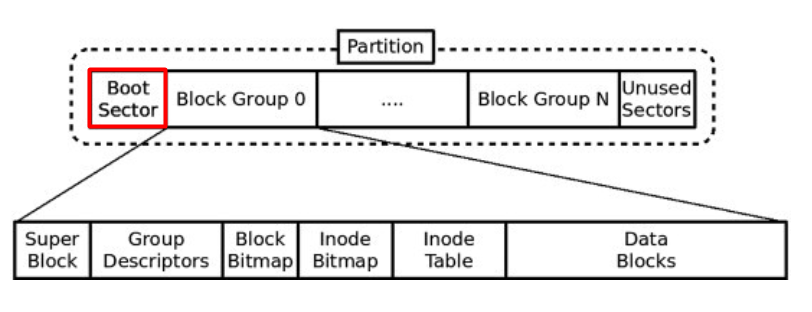

# 리눅스 마스터

### 목차
[Section 1. 리눅스 개요](#section-1-리눅스-개요)

1. [리눅스의 특징 및 장단점](#리눅스의-특징-및-장단점)
2. [파일시스템](#파일시스템)
3. [리눅스-파일-시스템의-종류](#리눅스-파일-시스템의-종류)
4. [리눅스-디렉터리-종류와-특징](#4-리눅스-디렉터리-종류와-특징)
5. [리눅스-배포판](#5-리눅스-배포판)

## Section 1. 리눅스 개요

### 리눅스의 특징 및 장단점
**특징**
- 오픈 소스 운영체제이다.
- 멀티유저(다중사용자), 멀티테스킹(다중작업) 운영체제이다.
- 다중스레드를 지원하는 네트워크 운영체제이다.
- `여러 종류의 파일시스템을 지원하는 운영체제`이다.

**장단점**
- 리눅스는 유닉스와 완벽하게 호환 가능하다.
- 리눅스는 PC용 운영체제보다 안정적이다.
- `하드웨어 기능을 효과적으로 사용`한다.
- 리눅스는 오픈 소스 운영체제이다.
- 공개 운영체제이기 때문에 문제점 발생 시 기술지원을 받기 어렵다.
- 한글 지원이 미흡하다.

 

파일시스템

### 2. 파일시스템
파일에 이름을 붙이고 저장, 탐색을 위해 파일을 어디에 위치 시킬 것인지 나타내는 체계를 말한다.

Boot Sector은 `MBR과 부트로더(LILO or GRUB)가 저장`되어 있는 구간이다.

**MBR**
- OS가 어디에 위치해있고 어떻게 위치해 있는지 식별해서 주기억장치에 적재될 수 있게 해주는 정보, 하드디스크가 포맷될 때 나뉘어지는 각 파티션의 위치에 관한 정보를 가지고 있음

**부트로더(BootLoader)**
- 부팅되기까지 부팅의 전과정을 진행하고 MBR에 저장된다.

**Super Block**
- 파일 시스템에서 사용되는 주요 설정 정보들이 기록되는 영역 (블록 크기, Block Group의 개수, inode 개수, 총 블록의 개수)

**Group Descriptors**
- 파일 시스템 내의 모든 블록 그룹들에 대한 정보를 기록

**inode**
- 파일 또는 디렉토리를 기술하는 데이터구조, 파일의 데이터 블록이 파티션에서 어디에 위치해있는지 등 주요 데이터를 가지고 있으므로 리눅스에서 ls -il을 치면 나온다.

 

### 3. 리눅스 파일 시스템의 종류
**EXT3**
- [저널링 기능](#저널링-기능) 이 도입되어 데이터 복구 기능이 강화되었다.
- 데이터를 디스크에 기록하기 전에 저널에 수정 사항을 기록한다.
- `디스크에 데이터 기록전에 시스템 크래쉬나 갑자기 전원이 나가도 저널의 기록을 보고 복구 가능`하다.
- 볼륨 크기는 2~32TB까지 지원한다.
- 서브 디렉토리 수는 32000개까지 지원한다.

    #### 저널링 기능
    - 파일 시스템이 깨지는 것과 같은 시스템 장애를 방지하기 위해 어디까지 정상 처리됐고, 어디서부터 재실행하면 되는지 알 수 있도록 저널을 남겨두는 기능

**EXT4**
- 1EB(엑사바이트) 이상의 볼륨을 지원한다.
- `파일 시스템의 축소와 확장이 자유롭다.`
- 서브 디렉토리 수는 64000개까지 지원한다.
- 온라인 디스크 조각 모음 기능이 추가되었다.

**XFS**
- Extent 기반이 완전히 탄탄해진 상태로 고성능 대용량 파일 시스템에 가장 적합하다.
- RHEL 7부터는 Default파일 시스템으로 지정되어 있다.
- EXT4가 가지고 있는 거의 모든 기능이 진원된다.
- XFS는 증설은 가능하지만 축소가 불가능하다.
- 최대 용량 8EB까지 지원한다.

 

📌 파일 시스템의 축소와 확장이 아무리 자유롭다고 해도 파일 시스템을 축소하는 작업은 권하지 않는다. 레드햇에서도 파일 시스템의 축소로 인한 메타 데이터 불일치의 가능성을 열어 놓았기 때문이다.

### 4. 리눅스 디렉터리 종류와 특징
디렉터리 | 저장내용 |
--- | --- |
/   |   파일 시스템이 있는 최상위 디렉터리로 루트 디렉터리라고 함 | 
/boot | 부트 디렉터리로 부팅 시 커널 이미지의 부팅 정보 저장 파일 | 
/proc | 시스템 정보 디렉터리 / 거널 기능을 제어하는 역할 (현재 실행되는 프로세스와 실제로 사용되는 장치, 하드웨어 정보 저장) |
/lib | 공유 라이브러리 디렉터리 (커널 모듈 파일들과 프로그램 실행을 지원해 주는 라이브러리 저장) | 
/bin | 기본적인 명령어가 저장된 디렉터리 (root 사용자와 일반 사용자가 함께 사용할 수 있는 명령의 디렉터리)|
/dev | 시스템 디바이스 파일들을 저장하는 디렉터리 (하드디스크 장치 파일, CD-ROM 장치 파일 같은 파일 저장) | 
/etc | 시스템 환경 설정 파일 저장 디렉터리 | 
/root | 시스템 관리자용 홈 디렉터리  |
/sbin | 관리자용 시스템 표준 명령 및 시스템 관리와 관련된 실행 명령어 저장 | 
/usr | 사용자 디렉터리로 사용자 데이터나 애플리케이션 저장 | 
/home | 사용자 계정 디렉터리로 계정들의 홈 디렉터리가 위치 (일반 사용자들이 로그인 시 처음으로 위치하게 되는 디렉터리) | 
/var | 가변 자료 저장 디렉터리로 로그 파일이나 메일 데이터 저장|
/tmp | 각종 프로그램이나 프로세스 작업을 할 때 임시로 생성되는 파일 저장 / 모든 사용자에 대해서 읽기와 쓰기가 허용 / 시티키 비트 설정으로 파일의 소유자만이 자신의 소유 파일을 지울 수 있음 | 
/mnt | 파일 시스템을 일시적으로 마운트 할 때 사용  |
/lost + fount | 결함이 있는 파일에 대한 정보가 저장되는 디렉터리  |

 

### 5. 리눅스 배포판
**슬랙웨어 리눅스**
- 배포판 가운데 가장 먼저 대중화된 배포판으로 1992년 패트릭 볼커딩에 의해 출시되었다.

**데비안**
- 데비안 프로젝트에서 만들어 배포하는 공개 운영체제로 GNU의 공식적인 후원을 받고있는 유일한 배포판

**우분투 **
-  데비안 GNU/리눅스에 기초한 운영체제

**레드햇**
- 미국의 레드햇사가 개발하던 리눅스 배포판이다.

**RHEL**
- 레드햇이 개발하여 판매하고 있는 상용 리눅스 배포판이다.

**페도라 **
- 리눅스 커널에 기반한 운영체제와 레드햇의 후원과 개발 공동체의 지원 아래 개발된 배포판이다.

**CentOS**
- 업스트림 소스인 레드햇 엔터프라이즈 리눅스와 완벽하게 호환되는 무료 기업용 컴퓨팅 운영체제이다.

**수세**
- 독일에서 출시된 배포판으로 유럽에서 인기를 누리고 있다.

