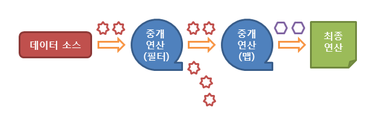

## 스트림 APi

스트림 API란 Java SE8부터 추가된 개념이다. 현재 자바에서는 많은 양의 데이터를 저장하기 위해서 배열이나 컬렉션을 사용하고 있다. 이렇게 저장된 데이터에 접근하기 위해서 반복문이나 반복자(iterator)를 사용하여 매번 새로운 코드를 작성해야 한다.

``` JAVA
import java.util.List;
import java.util.ArrayList;

class STREAM_API {
    public static void main(String[] args) {
        List<String> list = List.of("first", "second", "third");
        for(String order:list) {
            System.out.println(order);
        }
    }
}
```

- 위와 같이 코드가 길고 가독성도 굉장히 떨어진다. 코드의 재사용이 불가능하다.
- 데이터베이스의 쿼리와 같이 정형화된 처리 패턴이 없기 때문에 선언된 데이터마다 다른 방법으로 접근해야 한다.

```txt
💡 스트림 API는 데이터를 추상화하여 다루게 정형화된 패턴을 가지며, 다양한 방식으로 저장된 데이터를 읽고 쓰기 위한 공통된 방법을 제공한다.
```

### 스트림 API 특징
- 스트림은 내부 반복을 통해 작업을 수행
- 스트림은 재사용이 불가능하여 한 번만 사용할 수 있다.
- 스트림은 원본 데이터를 변경하지 않는다.
- 스트림은 연산 시 필터-맴(filter-map) 기반의 API를 사용하여 지연(lazy)연산을 통해 성능을 최적화 한다.
- 스트림은 paralleStream()메소드를 통한 손쉬운 병렬 처리를 지원한다.

### 스트림 API의 동작 흐름
1. 스트림의 생성
2. 스트림의 중개 연산 (스트림의 변환)
3. 스트림의 최종 연산 (스트림의 사용)

    